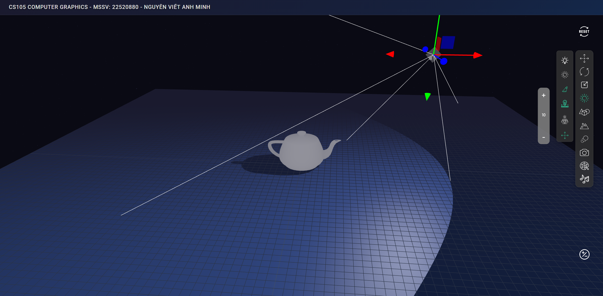

<a id="top"></a>

<!-- Banner -->
<p align="center">
  <a href="https://www.uit.edu.vn/" title="Trường Đại học Công nghệ Thông tin" style="border: none;">
    
  </a>
</p>

<h1 align="center"><b>ĐỒ HỌA MÁY TÍNH<br>(COMPUTER GRAPHICS)</b></h>

## [BẢNG MỤC LỤC](#top)

- [Giới thiệu môn học](#giới-thiệu-môn-học)
- [Thông tin các thành viên](#thông-tin-về-các-thành-viên-nhóm)
- [Thông tin final project](#thông-tin-final-project)
- [Các bước cần thiết](#các-bước-cần-thiết)

## [GIỚI THIỆU MÔN HỌC](#top)

- **Tên môn học:** Đồ họa Máy tính - Computer Graphics
- **Mã môn học:** CS105
- **Mã lớp:** CS105.P21
- **Năm học:** HK2 (2024 - 2025)
- **Giảng viên:** ThS. Cáp Phạm Đình Thăng

## [THÔNG TIN VỀ CÁC THÀNH VIÊN NHÓM](#top)

| STT |   MSSV   |       Họ và Tên       |                      Github                      |         Email          |
| :-: | :------: | :-------------------: | :----------------------------------------------: | :--------------------: |
|  1  | 22520880 | Nguyễn Viết Anh Minh  |    [vamnguyen](https://github.com/vamnguyen)     | 22520880@gm.uit.edu.vn |
|  2  | 21522245 | Mai Nguyễn Trung Kiên | [kieenef](https://github.com/MaiNguyenTrungKien) | 21522245@gm.uit.edu.vn |

## [THÔNG TIN FINAL PROJECT](#top)

- **Đề tài đồ án:** Mô phỏng hình học 3D
- **Công nghệ sử dụng:** HTML, CSS, JavaScript, Three.js, Vite.



## [CÁC BƯỚC CẦN THIẾT](#top)

### 1. Clone project

Clone project repository bằng câu lệnh dưới đây.

```bash
git clone https://github.com/vamnguyen/CS105_ComputerGraphics.git
```

### 2. Cài đặt thư viện

Trước tiên, bạn cần cài đặt [Node.js](https://nodejs.org/en). Sau đó, tiến hành cài đặt các thư viện cần thiết cho project với câu lệnh dưới đây.

```bash
cd CS105_ComputerGraphics
npm install
```

### 3. Chạy code

Sau khi cài đặt thư viện, dùng câu lệnh dưới đây để chạy code.

- Dùng câu lệnh bên dưới để chạy code trong folder Final.

```bash
npx vite Final
```
